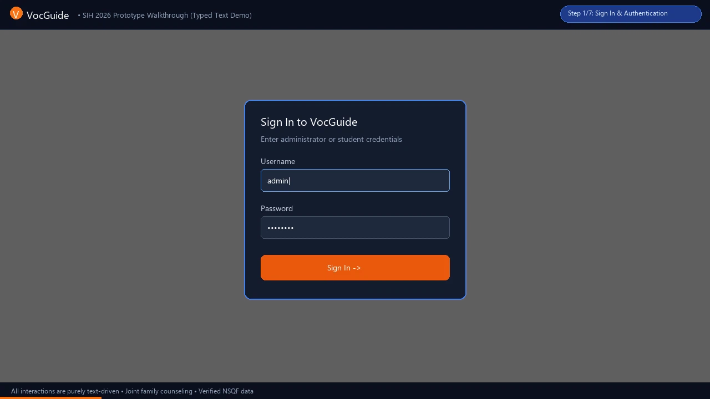
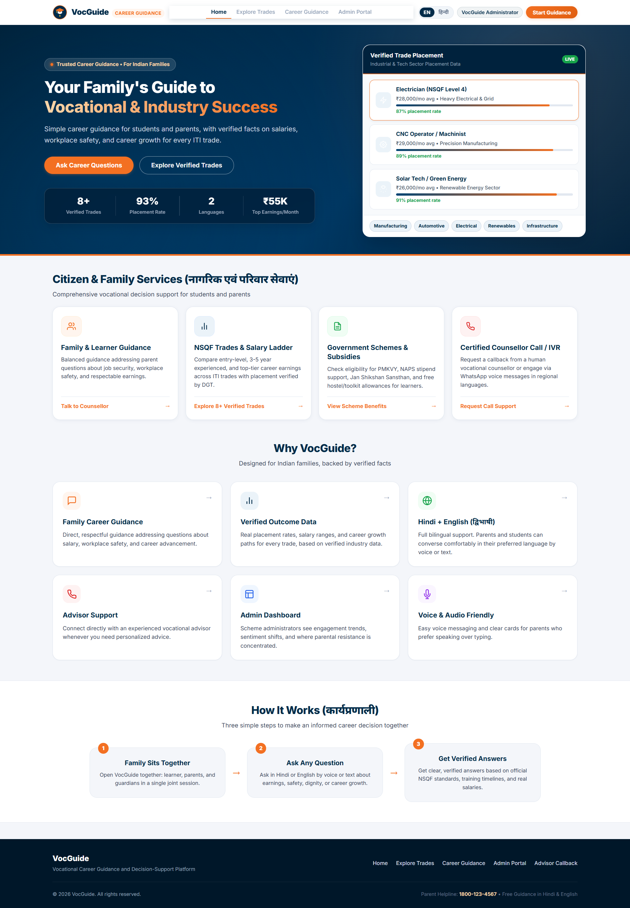
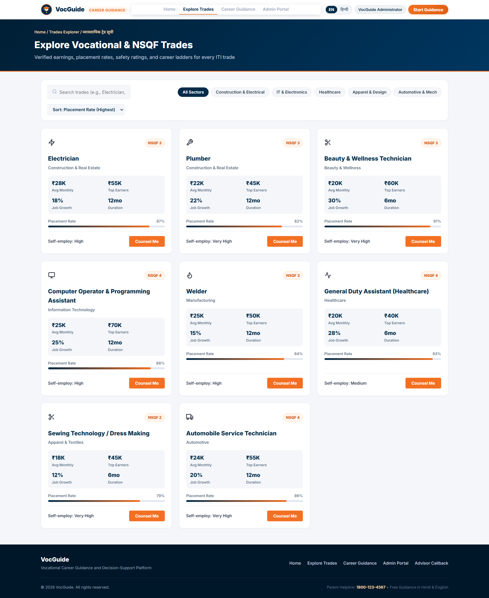
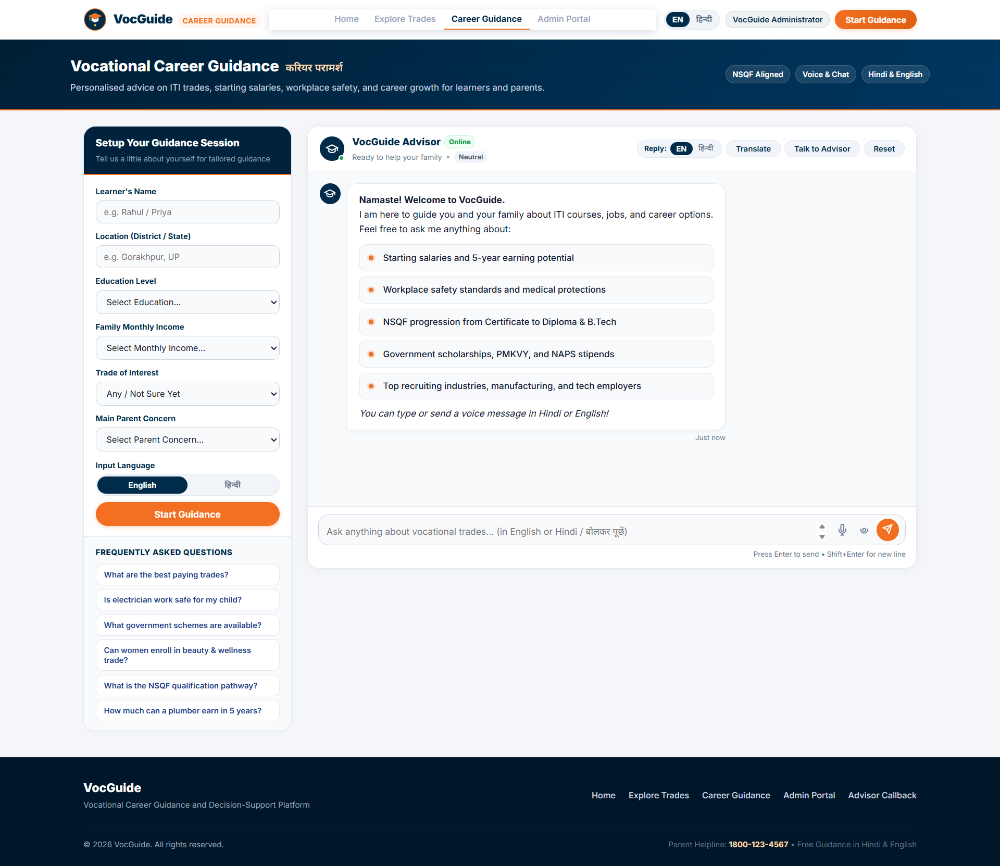
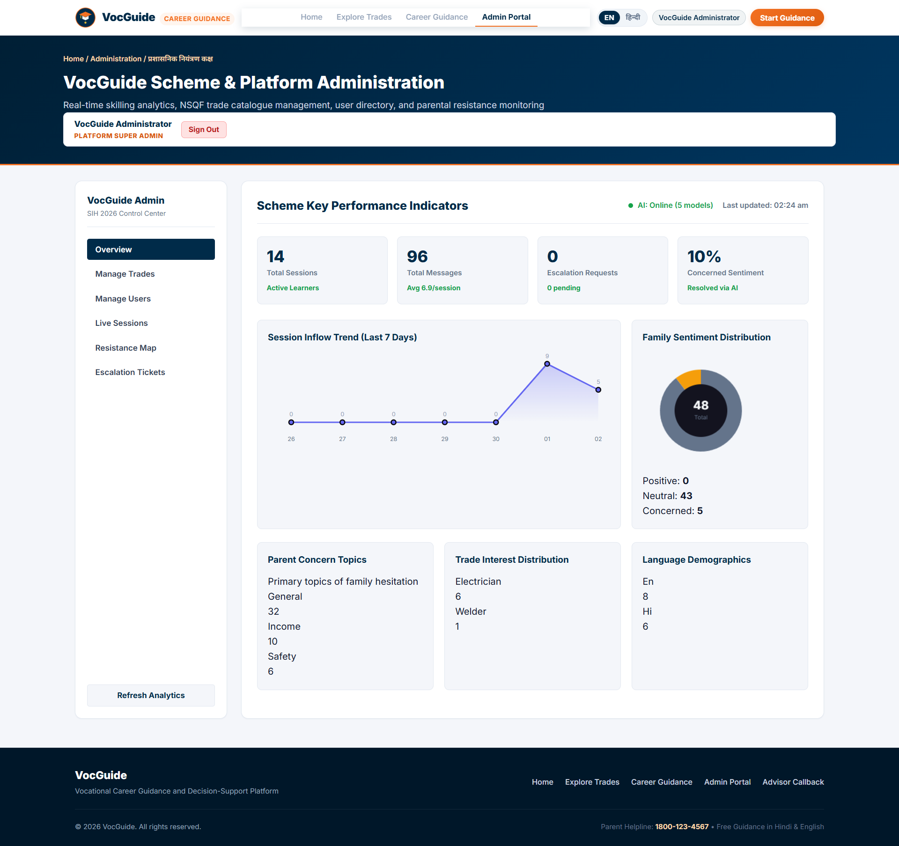
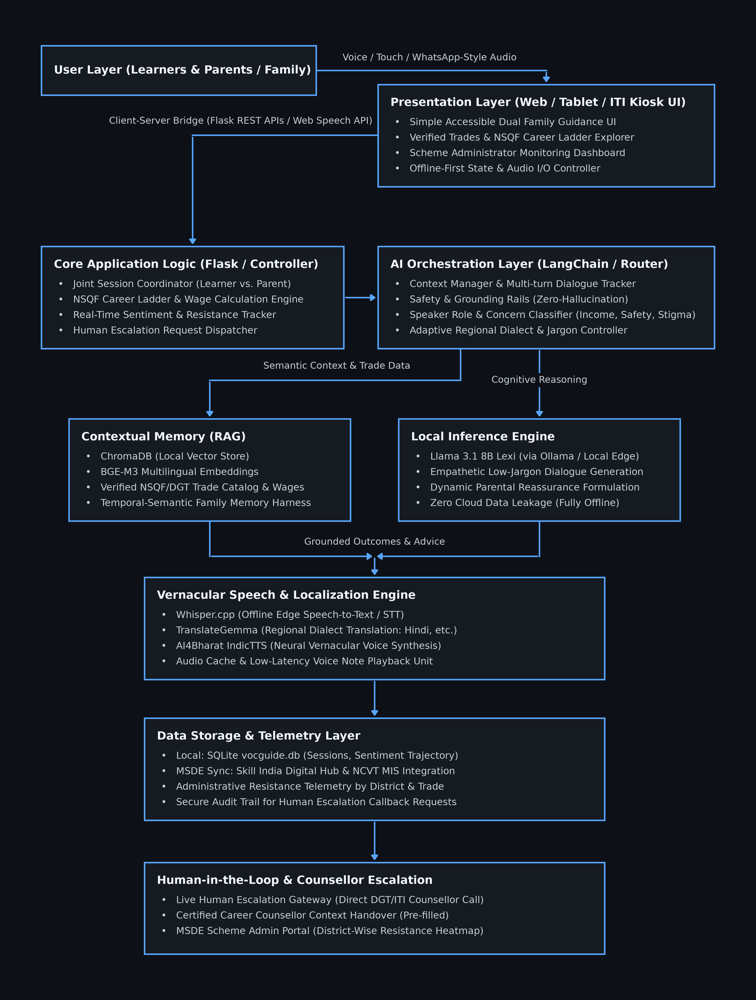
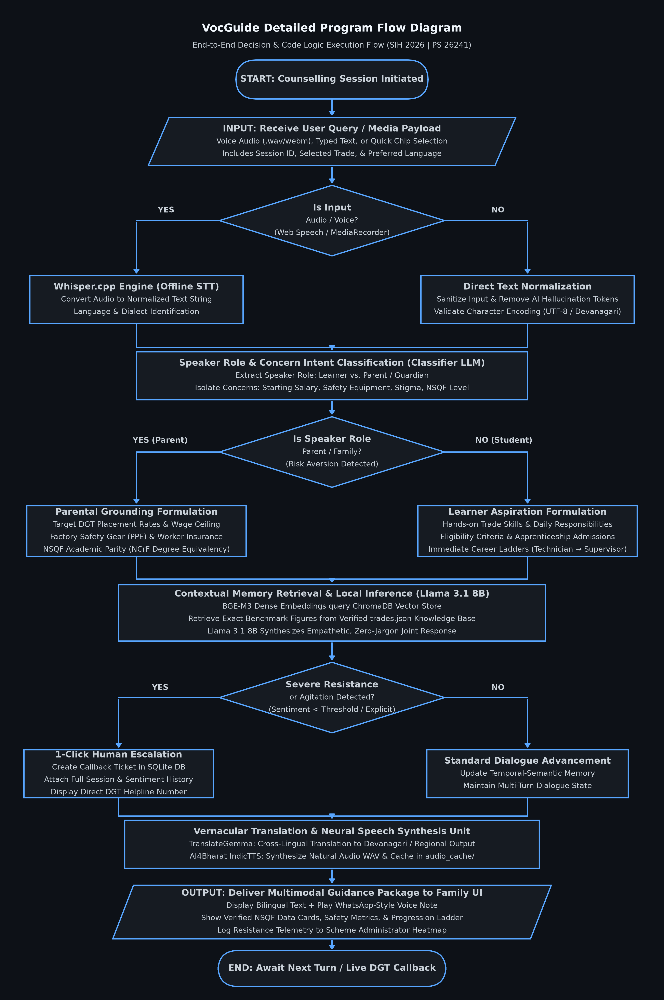

# 🎓 VocGuide — AI Career Counselling & Family Decision-Support Platform

**Smart India Hackathon 2026 | Problem Statement ID: 26241**

[](https://www.python.org/)
[](https://flask.palletsprojects.com/)
[](https://ollama.com/)
[](https://www.sih.gov.in/)

An AI-enabled career counselling platform for vocational education in India, designed to engage **both learners AND their families** together, addressing parental concerns with verified data, NSQF progression pathways, and regional language support.

---

## 🎥 Prototype Video Walkthrough (Typed Text Demonstration)

> **End-to-End Walkthrough:** Complete demonstration showing the platform flow from role-based login, NSQF trade filtering, family intake setup, pure typed-text AI family counselling with dual-role grounding, regional Hindi localization, to the administrative telemetry console.



> 💡 **Interactive Self-Running Demo:** You can open [`http://localhost:5000/walkthrough.html`](http://localhost:5000/walkthrough.html) in your browser for an automated interactive tour with simulated keystroke typing.

---

## 📸 Platform Screenshots

### 1. 🏠 Homepage & Citizen Family Services
> Intuitive, accessible landing page welcoming learners and parents with verified salary and placement highlights, dual-role guidance cards, and access to certified vocational advisors.



---

### 2. 🧭 Explore Verified NSQF Vocational Trades
> Compare verified trade data across sectors, viewing realistic entry-level to top-tier earnings, placement rates, self-employment opportunities, and course durations.



---

### 3. 🤖 AI Family Counsellor (Bilingual Audio & Chat)
> Joint family guidance session addressing parental hesitation, salary transparency, workplace safety, and government schemes in Hindi or English with real-time sentiment analysis and voice support.



---

### 4. 📊 Scheme Administration & Parental Resistance Analytics
> Real-time monitoring console for scheme directors to track session inflow trends, sentiment breakdown, top parent concern topics (Income, Safety, Social Stigma), and escalation callbacks.



---

## 🏗️ System Architecture & Execution Flow

### System Architecture
The platform is built on an offline-first architecture connecting the dual-user guidance interface with local LLM reasoning (Llama 3.1 8B via Ollama), ChromaDB vector retrieval, and speech localization engines.



### End-to-End Program Flow
Every user interaction passes through role classification (Learner vs. Parent), intent extraction, contextual grounding against verified trade benchmarks, and real-time resistance tracking.



---

## 🚀 Quick Start

### 1. Install Python dependencies
```bash
pip install flask flask-cors requests
```

### 2. Start Ollama (AI model)
```bash
ollama serve
# Ensure mannix/llama3.1-8b-lexi and translategemma models are available
```

### 3. Start VocGuide
```bash
python app.py
# Or double-click: start.bat
```

### 4. Open in browser
```
http://localhost:5000
```

---

## 🗂️ Project Structure

```
SIHProject/
├── app.py                  # Flask backend (API + AI integration + SQLite)
├── requirements.txt        # Python dependencies
├── start.bat              # One-click startup script
├── TTS_SETUP.md            # Neural TTS & Offline Whisper setup guide
├── data/
│   └── trades.json        # Verified trade data (8 trades)
├── static/
│   ├── index.html         # Main frontend (4 sections)
│   ├── style.css          # Premium responsive theme CSS
│   └── app.js             # Frontend JavaScript + API calls
└── presentation_assets/    # Architecture diagrams & presentation graphics
```

---

## ✨ Features

### 🤖 AI Family Counsellor
- Powered by **Ollama (mannix/llama3.1-8b-lexi)** running locally
- Addresses both **learner AND parent** questions in one session
- Responds with **verified NSQF/ITI data** — not generic content
- Detects sentiment shifts (positive / neutral / concerned) in real-time
- Suggests human counsellor escalation when needed

### 🌐 Multilingual Support (Hindi + English)
- Full UI translation between English and Hindi
- Chat works in both languages (auto-detected from user input)
- Translation powered by **translategemma** model
- Devanagari text rendering with Noto Sans Devanagari font

### 📊 Verified Trade Data (8 Trades)
| Trade | NSQF | Avg Salary | Placement |
|-------|------|-----------|-----------|
| Electrician | 3 | ₹28,000/mo | 87% |
| Computer Operator | 4 | ₹25,000/mo | 88% |
| Healthcare Assistant | 4 | ₹20,000/mo | 93% |
| Beauty & Wellness | 3 | ₹20,000/mo | 91% |
| Plumber | 3 | ₹22,000/mo | 82% |
| Welder | 3 | ₹25,000/mo | 84% |
| Automobile Technician | 4 | ₹24,000/mo | 86% |
| Sewing Technology | 2 | ₹18,000/mo | 79% |

### 📈 Admin Dashboard
- **KPI cards**: Sessions, messages, escalations, sentiment %
- **Session trend chart**: 7-day SVG line chart
- **Sentiment donut chart**: Canvas-rendered distribution
- **Resistance concentration map**: Where/why families resist
- **Session monitor**: Live table of all counselling sessions
- **Escalation queue**: Manage human counsellor callbacks

### ☎️ Human Escalation
- One-click request for human counsellor callback
- Session context (trade, concerns, sentiment) carried over
- Admin can track and resolve escalation requests
- Toll-free number shown for direct contact

### ♿ Accessibility Features
- Large, readable font sizes
- High contrast clean theme
- Voice input support (Web Speech API)
- Simple UI with icons for low-literacy users
- Mobile responsive design

---

## 🔌 API Endpoints

| Method | Endpoint | Description |
|--------|----------|-------------|
| GET | `/api/trades` | List all trades |
| GET | `/api/trades/<id>` | Get trade details |
| GET | `/api/providers` | Training providers |
| GET | `/api/schemes` | Government schemes |
| POST | `/api/sessions` | Create counselling session |
| POST | `/api/chat` | Send message to AI |
| POST | `/api/translate` | Translate text |
| POST | `/api/escalate` | Request human counsellor |
| GET | `/api/admin/stats` | Admin dashboard data |
| GET | `/api/admin/sessions` | All sessions |
| GET | `/api/admin/escalations` | Escalation requests |
| GET | `/api/admin/resistance-map` | Resistance data by location |
| GET | `/api/ollama/status` | AI model status |

---

## 🎯 Addressing Problem Requirements

| Requirement | Implementation |
|-------------|----------------|
| Engage learners + parents jointly | Session context captures both; AI prompted for family counselling |
| Regional language support | Hindi + English with `translategemma` model |
| Verified outcome data | `trades.json` with placement rates, salaries, NSQF levels |
| NSQF qualification pathway | Career progression shown in trade detail modal |
| Human escalation | Dedicated escalation modal + admin queue |
| Engagement/sentiment tracking | Per-message sentiment analysis + admin dashboard |
| Low-literacy design | Icon-heavy UI, large text, voice input |
| Admin resistance map | Location × concern-topic concentration visualization |

---

## 🛠️ Tech Stack

- **Backend**: Python 3.10+ + Flask + Flask-CORS
- **AI**: Ollama (mannix/llama3.1-8b-lexi for chat, translategemma for translation)
- **Frontend**: Vanilla HTML5/CSS3/JavaScript (no framework)
- **Fonts**: Inter + Noto Sans Devanagari (Google Fonts)
- **Data**: JSON-based trade database (easily replaceable with real NSDC data)

---

## 🔒 Data Privacy

- All sessions stored locally / in-memory
- No personal data stored beyond the session
- Escalation requests store only name and phone (as provided)
- Ollama runs fully locally — zero cloud data leakage

---

*Built for Smart India Hackathon 2026 — Ministry of Skill Development & Entrepreneurship*
